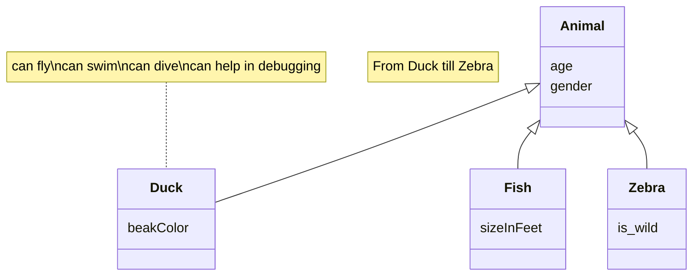

# Documento de análisis de requisitos del sistema
**Asignatura:** Diseño y Pruebas (Grado en Ingeniería del Software, Universidad de Sevilla)  
**Curso académico:** 2025/2026 
**Grupo/Equipo:** LI-04  
**Nombre del proyecto:** End of Line  
**Repositorio:** https://github.com/gii-is-DP1/dp1-2025-2026-li-4
**Integrantes (máx. 6):** Fernando José Fernández Fernández (HNR0360  / ferferfer@alum.us.es), Angelo Sho Moraschi (FLX0814  / angmor@alum.us.es), Alejandro Urbina Tamayo (VMC1155 / aleurbtam@alum.us.es), Makar Lavrov (RRP9465 / maklav@alum.us.es), Domingo Ruiz Bellido (DYS4321 / domruibel@alum.us.es).

_Esta es una plantilla que sirve como guía para realizar este entregable. Por favor, mantén las mismas secciones y los contenidos que se indican para poder hacer su revisión más ágil._ 

## Introducción

The project focuses on the implementation of the board game End of Line which is a strategic card-based board game where the main objective is simple: cut your opponent’s line before they cut yours. Players build paths by placing Line Cards on a shared grid, managing both placement and limited Energy Points to alter the flow of the game.

The game supports 2 players. The playing area is a 7x7 grid.

A typical match unfolds in rounds, each consisting of drawing cards and placing them to extend your line, always respecting directional connections. From the third round onward, players may spend energy to gain advantages such as speeding up, slowing down, or redirecting their line.

Games usually last between 15 and 40 minutes, depending on their choices. The match ends immediately when a player cannot continue their line on their turn — that player loses, and the opponent is declared the winner.

[Link to the video explaining the rules and playing a game](https://github.com/gii-is-DP1/dp1-2025-2026-li-4/blob/main/docs/Video.mp4)

## Tipos de Usuarios / Roles

- Player: a user registered on the platform who can join matches, manage their profile, view statistics and his/her list of games, and actively participate in games.
- Administrator: A user with platform management privileges who can view a list of ongoing games (including the creator and participating users), a list of completed games and their participants and maintain platform operation as needed.
- Guest: A person who only has the ability to either create a new account or log in to an existing one.

## Historias de Usuario

Next, they are defined all user story to be implemented.

### US#1-(ISSUE#33): Login ([Issue](https://github.com/gii-is-DP1/dp1-2025-2026-li-4/issues/33))

| "As a guest, I want to sign in to my account so that I can view my information and start playing"|
| ------------------------------------------------------------------------- |
||
|1. The user selects the “Log In” option on the initial screen.  |
|2. The Login page is displayed, where the user provides their credentials (username and password).  |
|3. After clicking the “Log In” button, if the credentials are valid, the user is taken to the Dashboard page.  |

### US#2-(ISSUE#36): Register ([Issue](https://github.com/gii-is-DP1/dp1-2025-2026-li-4/issues/36))

| "As a guest, I want to create a new account so that I can start playing."|
| ------------------------------------------------------------------------- |
||
|1. The user clicks the “Register” button on the initial screen, which opens the Registration page.  |
|2. To complete the registration, the user provides their name, surname, username, password, email, and date of birth.  |

### US#3-(ISSUE#37): Logout ([Issue](https://github.com/gii-is-DP1/dp1-2025-2026-li-4/issues/37))

| "As a player/administrator, I want to log out of my account so that no one else can access it from the same device."|
| ------------------------------------------------------------------------- |
||
|1. On the home screen, the player/administrator clicks the "Logout" button located at the top-right corner.  |
|2. A confirmation modal is shown just to ask if the player/administrator is sure about logging out.  |
|3. After clicking on "Yes", the user is signed out of the system.  |

### US#4-(ISSUE#38): Delete my profile ([Issue](https://github.com/gii-is-DP1/dp1-2025-2026-li-4/issues/38))

| "As a player/administrator, I want to remove my account so that all my data is erased from the system."|
| ------------------------------------------------------------------------- |
||
|1. On the home screen, the player/administrator clicks their profile button (top-right corner).  |
|2. A menu will appear showing several options, including the "Edit Profile" feature.  |
|3. The player selects "Edit Profile", which takes them to the "My Profile" screen.  |
|4. From there, if the player clicks the "Delete Profile" button and confirms by selecting "Yes" on the confirmation modal, their profile will be removed from the system.  |

### US#5-(ISSUE#39): Edit my profile ([Issue](https://github.com/gii-is-DP1/dp1-2025-2026-li-4/issues/39))

| "As a player/administrator, I want to edit my profile so that I can update my personal information."|
| ------------------------------------------------------------------------- |
||
|1. On the home screen, the player/administrator clicks their profile button (top-right corner).  |
|2. A menu will appear showing several options, including the "Edit Profile" feature.  |
|3. The player select "Edit Profile," which takes them to the "My Profile" screen.  |
|4. From there, clicking on the "Edit profile" button takes them to the "Edit profile" screen. |
|5. Once typed all the changes, the player/administrator will save them by clicking the "Save changes" button. |

### US#6-(ISSUE#40): Add a friend ([Issue](https://github.com/gii-is-DP1/dp1-2025-2026-li-4/issues/40))

| "As a player, I want to add a friend so that I can play with him/her."|
| ------------------------------------------------------------------------- |
||
|1. On the home screen, the player has to click their profile button. |
|2. A menu will appear showing several options, including the "Friendships" feature. |
|3. The player selects "Friendships", which takes them to the "Friendships" screen. |
|4. From there, there is a "Create" button and pressing it, the player is taken to "Create Friendship" screen.  |
|5. From there, the player can type the username of their new friend and send the invitation.  |

### US#7-(ISSUE#41): Delete a friend ([Issue](https://github.com/gii-is-DP1/dp1-2025-2026-li-4/issues/41))

| "As a player, I want to delete a friend so that I don't want to play more with him/her."|
| ------------------------------------------------------------------------- |
||
|1. On the home screen, the player has to click their profile button. |
|2. A menu will appear showing several options, including the "Friendships" feature. |
|3. The player selects "Friendships", which takes them to the "Friendships" screen. |
|4. From there, the player can see the list of his friends and can press the "Delete" button of the friendship the player wants to remove.  |
|5. A confirmation modal will appear asking if the player is sure about the deletion, pressing "Yes", the friendship will be deleted.  |

### US#8-(ISSUE#42): Accept a friendship ([Issue](https://github.com/gii-is-DP1/dp1-2025-2026-li-4/issues/42))

| "As a player, I want to accept a friendship so that I can play with the friend requester."|
| ------------------------------------------------------------------------- |
||
|1. On the home screen, the player has to click their profile button. |
|2. A menu will appear showing several options, including the "Friendships" feature. |
|3. The player selects "Friendships", which takes them to the "Friendships" screen. |
|4. From there, the player press the "Pending" button and takes them to the "Pending Invites" screen. |
|5. From there, the player can view any pending invitations and accept them using the "Accept" button.  |

### US#9-(ISSUE#43): Reject a friendship ([Issue](https://github.com/gii-is-DP1/dp1-2025-2026-li-4/issues/43))

| "As a player, I want to reject a friendship so that I don't want to play with the friend requester."|
| ------------------------------------------------------------------------- |
||
|1. On the home screen, the player has to click their profile button. |
|2. A menu will appear showing several options, including the "Friendships" feature. |
|3. The player selects "Friendships", which takes them to the "Friendships" screen. |
|4. From there, the player press the "Pending" button and takes them to the "Pending Invites" screen. |
|5. From there, the player can view any pending invitations and reject them using the "Reject" button.  |

### US#10-(ISSUE#44): Create a game ([Issue](https://github.com/gii-is-DP1/dp1-2025-2026-li-4/issues/44))

| "As a player, I want to create a new game so that other players can join it."|
| ------------------------------------------------------------------------- |
||
|1. On the home screen, the player clicks has to click the "Play now!" button and the "Create Game" screen game will be opened.  |
|2. The player has to select which one of their friends wants to play with and which colour card are going to play with. |
|3. When pressing the "Continue" button, the game starts.  |

### US#11-(ISSUE#45): Join a game ([Issue](https://github.com/gii-is-DP1/dp1-2025-2026-li-4/issues/45))

| "As a player, I want to enter a game so that I can play alongside the another player who has invited me."|
| ------------------------------------------------------------------------- |
||
|1. On the header of the home screen, an invitation message will appear showing that a friend invited the player to a game.  |
|2. The player has to click on the "Accept" button to start the game. |
|3. The player is taken to the "Game" screen and the game starts.  |

### US#12-(ISSUE#46): Change deck ([Issue](https://github.com/gii-is-DP1/dp1-2025-2026-li-4/issues/46))

| "As a player, I want to change my initial deck so that I can play with different cards. "|
| ------------------------------------------------------------------------- |
||
|1. The player clicks on the "Change deck" button, which is on the left-down corner, and the deck will be automatically changed.  |

### US#13-(ISSUE#47): Place a card ([Issue](https://github.com/gii-is-DP1/dp1-2025-2026-li-4/issues/47))

| "As a player, I want to place a card so that I can take an action during my turn. "|
| ------------------------------------------------------------------------- |
||
|1. During their turn, the player clicks on any of the 5 cards in the left panel of the screen.  |
|2. The player then clicks on any of the available cells on the board (highlighted in their color), and the card is placed.  |

### US#14-(ISSUE#48): Use "Speed Up" ([Issue](https://github.com/gii-is-DP1/dp1-2025-2026-li-4/issues/48))

| "As a player, I want to spend one energy point using a "speed up" so that I can place three cards instead of two "|
| ------------------------------------------------------------------------- |
||
|1. During their turn, the player clicks on the "Speed Up" button (located in the right panel of the screen).  |
|2. The player can now place three cards instead of the usual two. The energy card is rotated clockwise.  |

### US#15-(ISSUE#49): Use "Reverse" ([Issue](https://github.com/gii-is-DP1/dp1-2025-2026-li-4/issues/49))

| "As a player, I want to spend one energy point using a "reverse" so that I can continue my path through any available exit on my second-to-last card "|
| ------------------------------------------------------------------------- |
||
|1. During their turn, the player clicks on the "Reverse" button (located in the right panel of the screen).  |
|2. The player can now place their next card on any available exit of their second-to-last-card. The energy card is rotated clockwise.  |

### US#16-(ISSUE#50): Use "Brake" ([Issue](https://github.com/gii-is-DP1/dp1-2025-2026-li-4/issues/50))

| "As a player, I want to spend one energy point using a "brake" so that I can place one card instead of the usual two "|
| ------------------------------------------------------------------------- |
||
|1. During their turn, the player clicks on the "Brake" button (located in the right panel of the screen).  |
|2. The player can now place just one card in their turn. The energy card is rotated clockwise.  |

### US#17-(ISSUE#51): Use "Extra Gas" ([Issue](https://github.com/gii-is-DP1/dp1-2025-2026-li-4/issues/51))

| "As a player, I want to spend one energy point using an "Extra Gas" so that I can draw one more card "|
| ------------------------------------------------------------------------- |
||
|1. During their turn, the player clicks on the "Extra Gas" button (located in the right panel of the screen).  |
|2. The player has now one more card in their hand. The energy card is rotated clockwise.  |

### US#18-(ISSUE52): Surrender ([Issue](https://github.com/gii-is-DP1/dp1-2025-2026-li-4/issues/52))

| "As a player, I want to be able to end the game early so that I can surrender if I choose."|
| ------------------------------------------------------------------------- |
||
|1. The player can click the "Surrender" button (located in the top-right corner) and a confirmation modal appears.  |
|2. After the player clicks that he/she is sure, the game ends.  |

### US#19-(ISSUE#53): View rules during game ([Issue](https://github.com/gii-is-DP1/dp1-2025-2026-li-4/issues/53))

| "As a player, I want to view the rules so that I can follow the game correctly "|
| ------------------------------------------------------------------------- |
||
|1. The player can click the "Rules" button (located in the top-right corner) and the rules screen is shown.  |

### US#19-(ISSUE#54): Return to the game after viewing rules ([Issue](https://github.com/gii-is-DP1/dp1-2025-2026-li-4/issues/54))

| "As a player, I want to return to the game after viewing the rules so that I can continue playing. "|
| ------------------------------------------------------------------------- |
||
|1. On the "Rules" screen, the player clicks the "Game" button (located in the top-right corner) and the "Game" screen is shown.  |

### US#20-(ISSUE#55): Chat with the opponent ([Issue](https://github.com/gii-is-DP1/dp1-2025-2026-li-4/issues/55))

| "As a player, I want to chat with my opponent so that I can communicate during the game. "|
| ------------------------------------------------------------------------- |
||
|1. The player clicks on the input field in the Chat component (right panel of the screen).  |
|2. The player types their message and clicks "Send".  |
|3. The sent message appears in the conversation window above the input field.  |

### US#20-(ISSUE#56): Notify the player when they win or lose ([Issue](https://github.com/gii-is-DP1/dp1-2025-2026-li-4/issues/56))

| "As a player, I want to be notified when the game ends so that I know whether I won or lost "|
| ------------------------------------------------------------------------- |
||
|1. When the game ends, a popup will be shown notifying the player who has won.  |

### US#21-(ISSUE#57): List player games history ([Issue](https://github.com/gii-is-DP1/dp1-2025-2026-li-4/issues/57))

| "As a player, I want to view a list of my games so that I can see who I have played against."|
| ------------------------------------------------------------------------- |
||
|1. On the home screen, the player has to click their profile button. |
|2. A menu will appear showing several options, including the "My Games" feature. |
|3. The player selects "My Games", which takes them to the "My Games" screen. |
|4. From there, the player can view the list of games showing information about the game number, winner and players of each game.  |

### US#22-(ISSUE#58): View player achievements ([Issue](https://github.com/gii-is-DP1/dp1-2025-2026-li-4/issues/58))

| "As a player, I want to view my achievements so that I can track my progress in the game. "|
| ------------------------------------------------------------------------- |
||
|1. On the home screen, the player has to click their profile button. |
|2. A menu will appear showing several options, including the "Achievements" feature. |
|3. The player selects "Achievements", which takes them to the "Achievements" screen. |
|4. From there, the player can view the achievements earned and when, which not, and the description of each one. |

### US#23-(ISSUE#59): View player stats ([Issue](https://github.com/gii-is-DP1/dp1-2025-2026-li-4/issues/59))

| "As a player, I want to see my statistics so that I can track my performance in the game. "|
| ------------------------------------------------------------------------- |
||
|1. On the home screen, the player has to click their profile button. |
|2. A menu will appear showing several options, including the "Stats" feature. |
|3. The player selects "Stats", which takes them to the "My Stats" screen. |
|4. From there, the player can view their statistics, including games played, durations, wins... |

### US#24-(ISSUE#60): View current games ([Issue](https://github.com/gii-is-DP1/dp1-2025-2026-li-4/issues/60))

| "As an administrator, I want to see a list of all ongoing games so that I can manage them and assure their good functioning. "|
| ------------------------------------------------------------------------- |
||
|1. On the home screen, the administrator has to click on their profile button. |
|2. A menu will appear showing several options, including the "Games" feature. |
|3. The administrator selects "Games", which takes them to the "Games history" screen. |
|4. A list with all ongoing games is shown, showing for each game the players that are playing it and its creator. |

### US#25-(ISSUE#60): View past games ([Issue](https://github.com/gii-is-DP1/dp1-2025-2026-li-4/issues/61))

| "As an administrator, I want to see a list of all past games so that I can manage them. "|
| ------------------------------------------------------------------------- |
||
|1. On the home screen, the administrator has to click on their profile button. |
|2. A menu will appear showing several options, including the "Games" feature. |
|3. The administrator selects "Games", which takes them to the "Games history" screen. |
|4. A list with all past games is shown, showing for each game the players that played it and its creator. |

### US#26-(ISSUE#62): View all users ([Issue](https://github.com/gii-is-DP1/dp1-2025-2026-li-4/issues/62))

| "As an administrator, I want to see a list of all registered users so that I can manage them. "|
| ------------------------------------------------------------------------- |
||
|1. On the home screen, the administrator has to click on their profile button. |
|2. A menu will appear showing several options, including the "Users" feature. |
|3. The administrator selects "Users", which takes them to the "Users" screen. |
|4. A list with all users is shown, where the administrator can see for each user the username and the authority. |

### US#27-(ISSUE#63): Creation of user ([Issue](https://github.com/gii-is-DP1/dp1-2025-2026-li-4/issues/63))

| "As an administrator, I want to create a user so that I can add a new profile to the system "|
| ------------------------------------------------------------------------- |
||
|1. On the home screen, the administrator has to click on their profile button. |
|2. A menu will appear showing several options, including the "Users" feature. |
|3. The administrator selects "Users", which takes them to the "Users" screen. |
|4. From there, the administrator clicks the "Add User" button, which takes him/her to the "Create user" screen. |
|5. From there, the administrator fills the necessary information to create the user.  |
|6. Once the administrator clicks on "Save", the user is created.  |

### US#28-(ISSUE#64): Deletion of user ([Issue](https://github.com/gii-is-DP1/dp1-2025-2026-li-4/issues/64))

| "As an administrator, I want to delete a user so that I can delete a profile from the system "|
| ------------------------------------------------------------------------- |
||
|1. On the home screen, the administrator has to click on their profile button. |
|2. A menu will appear showing several options, including the "Users" feature. |
|3. The administrator selects "Users", which takes them to the "Users" screen. |
|4. From there, the administrator can delete any user clicking on their "Delete" button. |
|5. After clicking "Yes" on the confirmation modal, the user will be deleted. If the administrator click "No", the user won't be deleted.  |

### US#29-(ISSUE#65): Edition of user ([Issue](https://github.com/gii-is-DP1/dp1-2025-2026-li-4/issues/65))

| "As an administrator, I want to edit a user so that I can update their information on the system "|
| ------------------------------------------------------------------------- |
||
|1. On the home screen, the administrator has to click on their profile button. |
|2. A menu will appear showing several options, including the "Users" feature. |
|3. The administrator selects "Users", which takes them to the "Users" screen. |
|4. From there, the administrator can edit any user clicking on their "Edit" button, taking them to the "Edit User" screen. |
|5. From there, the administrator updates the necessary information to edit the user.  |
|6. Once the administrator clicks on "Save", the user is updated.  |

### US#30-(ISSUE#66): View rules ([Issue](https://github.com/gii-is-DP1/dp1-2025-2026-li-4/issues/66))

| "As a player/administrator, I want to view the rules of the games so that I can understand how to play "|
| ------------------------------------------------------------------------- |
||
|1. On the home screen, the player/administrator has to click on the "Rules" button, taking them to the "Rules" screen. |

## Diagrama conceptual del sistema
_En esta sección debe proporcionar un diagrama UML de clases que describa el modelo de datos a implementar en la aplicación. Este diagrama estará anotado con las restricciones simples (de formato/patrón, unicidad, obligatoriedad, o valores máximos y mínimos) de los datos a gestionar por la aplicación. _

_Recuerde que este es un diagrama conceptual, y por tanto no se incluyen los tipos de los atributos, ni clases específicas de librerías o frameworks, solamente los conceptos del dominio/juego que pretendemos implementar_
Ej:

_Si vuestro diagrama se vuelve demasiado complejo, siempre podéis crear varios diagramas para ilustrar todos los conceptos del dominio. Por ejemplo podríais crear un diagrama para cada uno de los módulos que quereis abordar. La única limitación es que hay que ser coherente entre unos diagramas y otros si nos referimos a las mismas clases_

_Puede usar la herramienta de modelado que desee para generar sus diagramas de clases. Para crear el diagrama anterior nosotros hemos usado un lenguaje textual y librería para la generación de diagramas llamada Mermaid_

_Si deseais usar esta herramienta para generar vuestro(s) diagramas con esta herramienta os proporcionamos un [enlace a la documentación oficial de la sintaxis de diagramas de clases de _ermaid](https://mermaid.js.org/syntax/classDiagram.html)_

## Reglas de Negocio

### R1 - Player count
The game will be played by two players, one against the other. For example, a game cannot start if there are less than two players in the lobby.

### R2 - Game over
The game will end once the line of a player is cut (the player cannot continue placing cards). For example, if the line of a player intersects with the line of another player and the first one cannot advance anymore.
If a player leaves during a match, they will be declared as having forfeited.

### R3 - Game area
The playable area is a 7x7 grid of potential card placements, and the lines can wrap around the borders. This means that if a line reaches the leftmost grid spot, it will continue on the rightmost grid spot.

### R4 - Turn order
For the first round, the player who revealed the card with the lowest number plays first. From the second round, the player with the lowest number on their last placed card plays. In the event of a tie, the comparison extends to the previously placed cards.

### R5 - Card placement
The card must be placed in an empty grid spot where the entry points of a card must align with one of the exit points of the player's previously placed cards. The players place 1 card on the first round and 2 cards on later rounds unless modified by energy effects.

### R6 - Energy constraints
Each player begins with 3 energy points. A player may consume only 1 energy point per round starting from round 3.

### R7 - Users and authentication
The user must be registered and logged in to create or play a game.

### R8 – Deck & shuffling
At the start of each game the deck is shuffled randomly and each player receives a fixed initial hand (5 cards). When the deck runs out, the discard pile is reshuffled to form a new draw deck.

### R9 – Card uniqueness & limits
The number of copies of each card type in a deck is limited to a predefined value (e.g., max 4 copies per card type). Deck composition rules must be enforced by the server when generating or changing decks.

### R10 – Energy recharging & cap
Players have a maximum energy cap of 5. At the end of every round (after both players act) each player recovers 1 energy point until the cap is reached. Energy expenditure and current energy are persisted in the game state.

### R11 - Turn timer & inactivity
Each player has a maximum turn time (e.g., 90 seconds). If the player exceeds this time without action, they receive a warning; after a configurable number of consecutive timeouts (e.g., 2), they automatically forfeit the match.

### R12 - Achievements & stat recording
All finished matches update a player’s statistics and achievements (wins, duration, special achievements). Achievements are only awarded once and recorded with timestamp. Administrators can correct stats in exceptional cases.