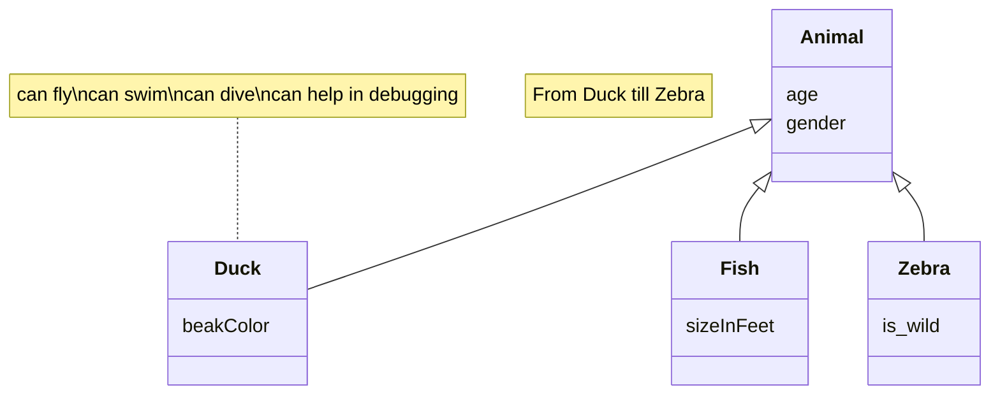

# Documento de análisis de requisitos del sistema
**Asignatura:** Diseño y Pruebas (Grado en Ingeniería del Software, Universidad de Sevilla)  
**Curso académico:** 2025/2026 
**Grupo/Equipo:** LI-04  
**Nombre del proyecto:** End of Line  
**Repositorio:** https://github.com/gii-is-DP1/dp1-2025-2026-li-4
**Integrantes (máx. 6):** Fernando José Fernández Fernández (HNR0360  / ferferfer@alum.us.es), Angelo Sho Moraschi (FLX0814  / angmor@alum.us.es), Alejandro Urbina Tamayo (VMC1155 / aleurbtam@alum.us.es), Makar Lavrov (RRP9465 / maklav@alum.us.es), Domingo Ruiz Bellido (DYS4321 / domruibel@alum.us.es).

_Esta es una plantilla que sirve como guía para realizar este entregable. Por favor, mantén las mismas secciones y los contenidos que se indican para poder hacer su revisión más ágil._ 

## Introducción

The project focuses on the implementation of the board game End of Line which is a strategic card-based board game where the main objective is simple: cut your opponent’s line before they cut yours. Players build paths by placing Line Cards on a shared grid, managing both placement and limited Energy Points to alter the flow of the game.

The game supports between 2 and 8 players. In a two-player match, the playing area is a 7x7 grid, and more players expand the grid size accordingly.

A typical match unfolds in rounds, each consisting of drawing cards and placing them to extend your line, always respecting directional connections. From the third round onward, players may spend energy to gain advantages such as speeding up, slowing down, or redirecting their line.

Games usually last between 15 and 40 minutes, depending on the number of players and their choices. The match ends immediately when a player cannot continue their line on their turn — that player loses, and the opponent is declared the winner.

[Link to the video explaining the rules and playing a game](https://github.com/gii-is-DP1/dp1-2025-2026-li-4/blob/main/docs/Video.mp4)

## Tipos de Usuarios / Roles

- Player: a user registered on the platform who can join matches, manage their profile, view statistics and his/her list of games, and actively participate in games.
 - Administrator: A user with platform management privileges who can view a list of ongoing games (including the creator and participating users), a list of completed games and their participants and maintain platform operation as needed.

## Historias de Usuario

Next, they are defined all user story to be implemented.

 ### US-(ISSUE#01): Create a new match ([Link to the issue associated with this user story]()
 As a player, I want to create a new match so that I can invite other players and start a game.

|Mockups (prototipos en formato imagen de baja fidelidad) de la interfaz de usuario del sistema|

Interactions with the user interface:
    1. Player clicks "Create a game" on the dashboard.
    2. Player sets the match parameters (number of players).
    3. Player sends invitations to other registered users (by a code or just sending a notification to them).
    4. Player clicks "Start game" to initialize the game once participants have joined.

## Diagrama conceptual del sistema
_En esta sección debe proporcionar un diagrama UML de clases que describa el modelo de datos a implementar en la aplicación. Este diagrama estará anotado con las restricciones simples (de formato/patrón, unicidad, obligatoriedad, o valores máximos y mínimos) de los datos a gestionar por la aplicación. _

_Recuerde que este es un diagrama conceptual, y por tanto no se incluyen los tipos de los atributos, ni clases específicas de librerías o frameworks, solamente los conceptos del dominio/juego que pretendemos implementar_
Ej:

_Si vuestro diagrama se vuelve demasiado complejo, siempre podéis crear varios diagramas para ilustrar todos los conceptos del dominio. Por ejemplo podríais crear un diagrama para cada uno de los módulos que quereis abordar. La única limitación es que hay que ser coherente entre unos diagramas y otros si nos referimos a las mismas clases_

_Puede usar la herramienta de modelado que desee para generar sus diagramas de clases. Para crear el diagrama anterior nosotros hemos usado un lenguaje textual y librería para la generación de diagramas llamada Mermaid_

_Si deseais usar esta herramienta para generar vuestro(s) diagramas con esta herramienta os proporcionamos un [enlace a la documentación oficial de la sintaxis de diagramas de clases de _ermaid](https://mermaid.js.org/syntax/classDiagram.html)_

## Reglas de Negocio
### R-< X > < Nombre Regla de negocio >
_< Descripción de la restricción a imponer >_

_Ej:_ 
### R1 – Diagnósticos imposibles
El diagnóstico debe estar asociado a una enfermedad que es compatible con el tipo de mascota de su visita relacionada. Por ejemplo, no podemos establecer como enfermedad diagnosticada una otitis cuando la visita está asociada a una mascota que es un pez, porque éstos no tienen orejas ni oídos (y por tanto no será uno de los tipos de mascota asociados a la enfermedad otitis en el vademecum).

…

_Muchas de las reglas del juego se transformarán en nuestro caso en reglas de negocio, por ejemplo, “la carta X solo podrá jugarse en la ronda Y si en la ronda anterior se jugó la carta Z”, o “en caso de que un jugador quede eliminado el turno cambia de sentido”_

