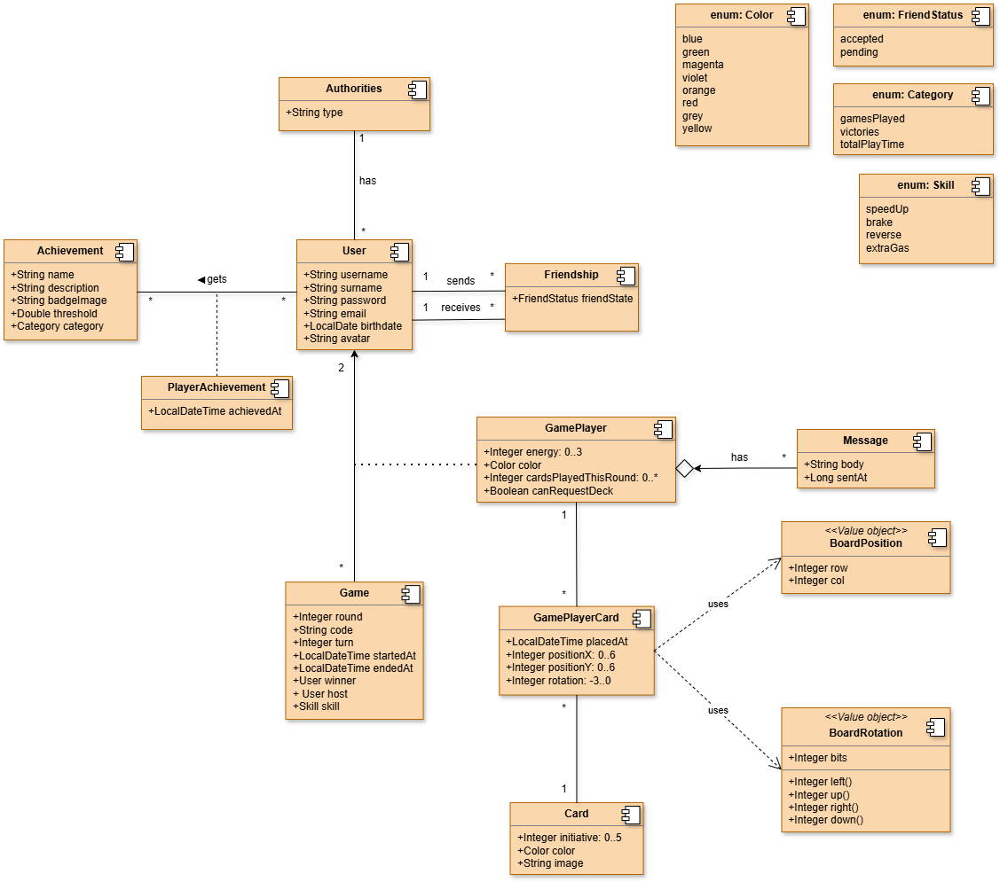

# Documento de análisis de requisitos del sistema
**Asignatura:** Diseño y Pruebas (Grado en Ingeniería del Software, Universidad de Sevilla)  
**Curso académico:** 2025/2026 
**Grupo/Equipo:** LI-04  
**Nombre del proyecto:** End of Line  
**Repositorio:** https://github.com/gii-is-DP1/dp1-2025-2026-li-4
Next, they are defined all user story to be implemented. Every story includes acceptance criteria and related business rules for testability and traceability.

### US#1-(ISSUE#33): Login ([Issue](https://github.com/gii-is-DP1/dp1-2025-2026-li-4/issues/33))
**Story**: As a guest, I want to sign in to my account so that I can view my information and start playing.

**Flow**
1. The user selects “Log In” on the initial screen.
2. The Login page is displayed to provide username and password.
3. After clicking “Log In”, if credentials are valid, the user is taken to the dashboard.

**Acceptance Criteria**
- Given valid credentials, when submitting, then the user is authenticated and redirected to dashboard.
- Given invalid credentials, when submitting, then an error message is shown without clearing inputs.
- Given empty fields, when submitting, then field-level validation messages appear.
- Response time for authentication < 2 seconds.

**Business Rules**: R7.

### US#2-(ISSUE#36): Register ([Issue](https://github.com/gii-is-DP1/dp1-2025-2026-li-4/issues/36))
**Story**: As a guest, I want to create a new account so that I can start playing.

**Flow**
1. The user clicks “Register” on the initial screen to open the Registration page.
2. The user fills name, surname, username, password, email, and date of birth.

**Acceptance Criteria**
- Username is 3-20 alphanumeric characters and unique; email is unique and valid; password min 8 chars with 1 uppercase and 1 number; age ≥ 13 years.
- All fields are required; inline errors show which field fails.
- On success, account is created and user is redirected to login or auto-logged in.
- Duplicate username/email shows a specific error message.

**Business Rules**: R7.

### US#3-(ISSUE#37): Logout ([Issue](https://github.com/gii-is-DP1/dp1-2025-2026-li-4/issues/37))
**Story**: As a player/administrator, I want to log out so that no one else can access my account from this device.

**Flow**
1. On the home screen, the user clicks the “Logout” button (top-right).
2. A confirmation modal asks for confirmation.
3. After confirming, the user is signed out and session tokens are cleared.

**Acceptance Criteria**
- Session is invalidated server-side and tokens removed client-side.
- Returning to a protected page prompts login.
- If cancel is pressed, session remains active.

**Business Rules**: R7.

### US#4-(ISSUE#38): Delete my profile ([Issue](https://github.com/gii-is-DP1/dp1-2025-2026-li-4/issues/38))
**Story**: As a player/administrator, I want to remove my account so that all my data is erased from the system.

**Flow**
1. From home, the user opens the profile menu and selects “Edit Profile”.
2. On “My Profile”, the user clicks “Delete Profile”.
3. A confirmation modal appears; upon confirmation the profile is deleted.

**Acceptance Criteria**
- Deletion is blocked if user is in an active game.
- All personal data, friendships, and stats are removed; audit log records the deletion.
- User cannot log in after deletion; attempting shows “Account removed”.

**Business Rules**: R7, R2 (for active game constraint).

### US#5-(ISSUE#39): Edit my profile ([Issue](https://github.com/gii-is-DP1/dp1-2025-2026-li-4/issues/39))
**Story**: As a player/administrator, I want to edit my profile so that I can update my personal information.

**Flow**
1. From home, the user opens the profile menu and selects “Profile”.
2. On “My Profile”, the user edits the fields and clicks “Save changes”.

**Acceptance Criteria**
- Username/email uniqueness validated; invalid formats show inline errors.
- Changes persist and are visible on next login.
- Unauthorized edits (other users) are rejected.

**Business Rules**: R7.

### US#6-(ISSUE#40): Add a friend ([Issue](https://github.com/gii-is-DP1/dp1-2025-2026-li-4/issues/40))
**Story**: As a player, I want to add a friend so that I can play with them.

**Flow**
1. From home, the user opens “Friends”.
2. In “Friendships”, clicks “Create” to open “Create Friendship”.
3. Enters the friend’s username and sends the request.

**Acceptance Criteria**
- Request fails with clear message if username not found or already a friend.
- Duplicate pending requests are prevented.
- Sender sees request in “Pending”; receiver sees invite in “Pending Invites”.

**Business Rules**: R7.

### US#7-(ISSUE#41): Delete a friend ([Issue](https://github.com/gii-is-DP1/dp1-2025-2026-li-4/issues/41))
**Story**: As a player, I want to delete a friend so that I can stop playing with them.

**Flow**
1. From “Friendships”, the player views the friends list.
2. Clicks “Delete” on a friendship and confirms.

**Acceptance Criteria**
- Friendship is removed for both users.
- Cannot delete while both are in the same active game lobby.
- UI refreshes list without requiring reload.

**Business Rules**: R7, R2 (active game restriction).

### US#8-(ISSUE#42): Accept a friendship ([Issue](https://github.com/gii-is-DP1/dp1-2025-2026-li-4/issues/42))
**Story**: As a player, I want to accept a friendship so that I can play with the requester.

**Flow**
1. From “Friendships”, open “Pending Invites”.
2. Click “Accept” on a pending invite.

**Acceptance Criteria**
- Accept only if invite is still pending; otherwise show “Invite expired”.
- After acceptance, both users appear in each other’s friends list.
- Notification is sent to the requester.

**Business Rules**: R7.

### US#9-(ISSUE#43): Reject a friendship ([Issue](https://github.com/gii-is-DP1/dp1-2025-2026-li-4/issues/43))
**Story**: As a player, I want to reject a friendship so that I can decline the request.

**Flow**
1. From “Pending Invites”, click “Reject”.

**Acceptance Criteria**
- Pending invite is removed and requester is notified.
- Rejection is idempotent; repeated rejects show “Already rejected/expired”.

**Business Rules**: R7.

### US#10-(ISSUE#44): Create a game ([Issue](https://github.com/gii-is-DP1/dp1-2025-2026-li-4/issues/44))
**Story**: As a player, I want to create a new game so that other players can join it.

**Flow**
1. On home, click “Play now!” → “Create Game” to open the lobby.
2. Host waits for a friend to join via shared code and selects colors.
3. Press “Continue” to start the game.

**Acceptance Criteria**
- Lobby allows max 2 players; start disabled until both ready (R1).
- Game code is unique and expires after 24 hours or on use.
- Both players must select different colors; validation blocks duplicates.
- Lobby auto-expires after 15 minutes of inactivity.

**Business Rules**: R1, R3, R7, R8, R9.

### US#11-(ISSUE#45): Join a game ([Issue](https://github.com/gii-is-DP1/dp1-2025-2026-li-4/issues/45))
**Story**: As a player, I want to enter a game so that I can play with the host who shared a code.

**Flow**
1. On home, click “Play now!” → “Join Game”.
2. Enter the code and click “Join”.
3. Arrive at the friend lobby and wait for host to start.

**Acceptance Criteria**
- Invalid/expired code shows clear error; joining full lobby is blocked.
- Joined player sees selected colors and ready state.
- If host leaves, guest is notified and lobby closes.

**Business Rules**: R1, R7, R8.

### US#12-(ISSUE#46): Change deck in-game ([Issue](https://github.com/gii-is-DP1/dp1-2025-2026-li-4/issues/46))
**Story**: As a player, I want to change my initial deck so that I can play with different cards.

**Flow**
1. During setup, click “Change deck” (left-down corner) to reroll the deck.

**Acceptance Criteria**
- Deck follows composition limits (R8, R9); invalid decks are rejected with reasons.
- Deck change allowed only before game start; once started, button is disabled.
- New deck is confirmed to both players and stored server-side.

**Business Rules**: R8, R9.

### US#13-(ISSUE#47): Place a card ([Issue](https://github.com/gii-is-DP1/dp1-2025-2026-li-4/issues/47))
**Story**: As a player, I want to place a card so that I can act during my turn.

**Flow**
1. During their turn, the player clicks a card in hand.
2. Clicks an available cell on the board; the card is placed.

**Acceptance Criteria**
- Placement validates grid bounds and alignment rules (R3, R5).
- Two cards per turn by default; first round only one (R4, R5).
- Placement result appears in < 500 ms; illegal moves show reason and are blocked.

**Business Rules**: R3, R4, R5, R10.

### US#14-(ISSUE#48): Use "Speed Up" ([Issue](https://github.com/gii-is-DP1/dp1-2025-2026-li-4/issues/48))
**Story**: As a player, I want to spend one energy point using “Speed Up” so that I can place three cards instead of two.

**Flow**
1. During turn (round ≥ 3), click “Speed Up” in the right panel.
2. Place three cards this turn; energy card rotates clockwise.

**Acceptance Criteria**
- Requires player turn, round ≥ 3, and ≥1 energy (R6).
- Energy reduced by 1 and cannot drop below 0.
- Effect applies only for the current turn.

**Business Rules**: R5, R6.

### US#15-(ISSUE#49): Use "Reverse" ([Issue](https://github.com/gii-is-DP1/dp1-2025-2026-li-4/issues/49))
**Story**: As a player, I want to spend one energy point using “Reverse” so that I can branch from my second-to-last card.

**Flow**
1. During turn (round ≥ 3), click “Reverse”.
2. Place the next card on any available exit of the second-to-last card; energy rotates.

**Acceptance Criteria**
- Requires player turn, round ≥ 3, and ≥1 energy (R6).
- Placement still must satisfy adjacency/connection rules (R5).
- Energy reduced by 1; effect limited to next placement only.

**Business Rules**: R5, R6.

### US#16-(ISSUE#50): Use "Brake" ([Issue](https://github.com/gii-is-DP1/dp1-2025-2026-li-4/issues/50))
**Story**: As a player, I want to spend one energy point using “Brake” so that I can place one card instead of two.

**Flow**
1. During turn (round ≥ 3), click “Brake”.
2. Place only one card this turn; energy rotates.

**Acceptance Criteria**
- Requires player turn, round ≥ 3, and ≥1 energy (R6).
- Turn ends after one valid placement.
- Energy reduced by 1; effect limited to current turn.

**Business Rules**: R5, R6.

### US#17-(ISSUE#51): Use "Extra Gas" ([Issue](https://github.com/gii-is-DP1/dp1-2025-2026-li-4/issues/51))
**Story**: As a player, I want to spend one energy point using “Extra Gas” so that I can draw one more card.

**Flow**
1. During turn (round ≥ 3), click “Extra Gas”.
2. Draw an additional card; energy rotates.

**Acceptance Criteria**
- Requires player turn, round ≥ 3, and ≥1 energy (R6).
- Hand increases by one and respects max hand size (if any).
- Energy reduced by 1; draw is immediate.

**Business Rules**: R6, R8.

### US#18-(ISSUE#52): Surrender ([Issue](https://github.com/gii-is-DP1/dp1-2025-2026-li-4/issues/52))
**Story**: As a player, I want to end the game early so that I can surrender if I choose.

**Flow**
1. Click “Surrender” (top-right); a confirmation modal appears.
2. Confirm to end the game.

**Acceptance Criteria**
- Confirmation required; cancel keeps game running.
- Opponent is declared winner; stats update accordingly (R11).
- Cannot surrender after game already ended.

**Business Rules**: R2, R7, R11.

### US#19-(ISSUE#53): View rules during game ([Issue](https://github.com/gii-is-DP1/dp1-2025-2026-li-4/issues/53))
**Story**: As a player, I want to view the rules during a game so that I can follow them correctly.

**Flow**
1. Click “Rules” (top-right) during a game to open the rules screen.

**Acceptance Criteria**
- Rules open without leaving the match state.
- Timer pauses/continues per design (specify: pauses during view).
- Returning to game restores the same board state.

**Business Rules**: R4, R5, R10.

### US#20-(ISSUE#54): Return to the game after viewing rules ([Issue](https://github.com/gii-is-DP1/dp1-2025-2026-li-4/issues/54))
**Story**: As a player, I want to return to the game after viewing the rules so that I can continue playing.

**Flow**
1. On the “Rules” screen, click “Game” to return to the match.

**Acceptance Criteria**
- Player returns to the same turn, board, and timer state.
- No extra actions are consumed while in the rules screen.

**Business Rules**: R10.

### US#21-(ISSUE#55): Chat with the opponent ([Issue](https://github.com/gii-is-DP1/dp1-2025-2026-li-4/issues/55))
**Story**: As a player, I want to chat with my opponent so that I can communicate during the game.

**Flow**
1. Click the chat input, type a message, and press “Send”.

**Acceptance Criteria**
- Sent messages appear in under 1 second; failed sends show an error.
- Offensive content filtering or rate limiting is applied if specified.
- Chat history persists during the match; clears after match ends.

**Business Rules**: R7.

### US#22-(ISSUE#56): Notify the player when they win or lose ([Issue](https://github.com/gii-is-DP1/dp1-2025-2026-li-4/issues/56))
**Story**: As a player, I want to be notified when the game ends so that I know whether I won or lost.

**Flow**
1. When the game ends, a popup shows the winner/loser.

**Acceptance Criteria**
- Popup shows winner, final state, and option to go to lobby or stats.
- Stats and achievements are updated before popup is shown (R11).
- Popup appears to both players simultaneously.

**Business Rules**: R2, R11.

### US#23-(ISSUE#57): List player games history ([Issue](https://github.com/gii-is-DP1/dp1-2025-2026-li-4/issues/57))
**Story**: As a player, I want to view a list of my games so that I can see who I have played against.

**Flow**
1. From profile menu, select “Games”.
2. View list with start date, end date, winner, and players.

**Acceptance Criteria**
- Pagination or scroll for long history; default sorted by most recent.
- Each entry links to basic stats (duration, date, opponent).
- Access restricted to authenticated user viewing own history.

**Business Rules**: R7, R11.

### US#24-(ISSUE#58): View player achievements ([Issue](https://github.com/gii-is-DP1/dp1-2025-2026-li-4/issues/58))
**Story**: As a player, I want to view my achievements so that I can track my progress.

**Flow**
1. From profile menu, select “Achievements”.
2. View earned and locked achievements with descriptions.

**Acceptance Criteria**
- Earned achievements show earned date; locked show requirement.
- Achievements are awarded once and stored with timestamp (R11).
- Updates immediately after a match that triggers an achievement.

**Business Rules**: R11.

### US#25-(ISSUE#59): View player stats ([Issue](https://github.com/gii-is-DP1/dp1-2025-2026-li-4/issues/59))
**Story**: As a player, I want to view my personal game statistics so that I can understand my performance and progress over time.

**Flow**
1. Player logs in and navigates to “My Statistics”.
2. The system retrieves aggregated statistics from completed games.
3. The system displays games played, wins, losses, and average duration.

**Acceptance Criteria**
- Only finished games are considered.
- Wins and losses are consistent with game results.
- Statistics update automatically after a game ends.
- If no data exists, default placeholders are shown.

**Business Rules**: R2, R11.

### US#26-(ISSUE#60): View current games ([Issue](https://github.com/gii-is-DP1/dp1-2025-2026-li-4/issues/60))
**Story**: As an administrator, I want to see ongoing games so that I can manage them.

**Flow**
1. From profile menu, select “Games”.
2. On “Games history”, view ongoing games with players and creator.

**Acceptance Criteria**
- List refreshes periodically; shows status and start time.
- Admin-only access; non-admins receive authorization error.
- Allows navigation to a game detail for diagnostics.

**Business Rules**: R7, R1, R2.

### US#27-(ISSUE#61): View past games ([Issue](https://github.com/gii-is-DP1/dp1-2025-2026-li-4/issues/61))
**Story**: As an administrator, I want to see past games so that I can manage them.

**Flow**
1. From “Games history”, switch to past games list.

**Acceptance Criteria**
- Shows players, creator, winner, and end time.
- Supports filtering by date, player, or outcome.
- Admin-only access.

**Business Rules**: R7, R2, R11.

### US#28-(ISSUE#62): View all users ([Issue](https://github.com/gii-is-DP1/dp1-2025-2026-li-4/issues/62))
**Story**: As an administrator, I want to see all registered users so that I can manage them.

**Flow**
1. From profile menu, select “Users”.
2. View list with username and authority.

**Acceptance Criteria**
- Search/filter by username/role; pagination for large lists.
- Admin-only; edits/deletes require separate permissions.

**Business Rules**: R7.

### US#29-(ISSUE#63): Creation of user ([Issue](https://github.com/gii-is-DP1/dp1-2025-2026-li-4/issues/63))
**Story**: As an administrator, I want to create a user so that I can add a new profile.

**Flow**
1. From “Users”, click “Add User” to open creation form.
2. Fill required data and save.

**Acceptance Criteria**
- Same validation rules as registration (US#2); enforces unique username/email.
- On success, new user appears in list; on failure, specific errors shown.

**Business Rules**: R7.

### US#30-(ISSUE#64): Deletion of user ([Issue](https://github.com/gii-is-DP1/dp1-2025-2026-li-4/issues/64))
**Story**: As an administrator, I want to delete a user so that I can remove a profile from the system.

**Flow**
1. From “Users”, click “Delete” on a user and confirm.

**Acceptance Criteria**
- Cannot delete users currently in active games; shows blocking message.
- Confirmation modal displays username to avoid mistakes.
- Cascade removal of friendships and pending invites; audit log entry created.

**Business Rules**: R7, R2.

### US#31-(ISSUE#65): Edition of user ([Issue](https://github.com/gii-is-DP1/dp1-2025-2026-li-4/issues/65))
**Story**: As an administrator, I want to edit a user so that I can update their information.

**Flow**
1. From “Users”, click “Edit” to open the edit form.
2. Update necessary information and save.

**Acceptance Criteria**
- Validation matches registration rules; uniqueness enforced.
- Changes persist and appear in list after save.
- Prevent demoting the last administrator to avoid lockout.

**Business Rules**: R7.

### US#32-(ISSUE#66): View rules ([Issue](https://github.com/gii-is-DP1/dp1-2025-2026-li-4/issues/66))
**Story**: As a player/administrator, I want to view the rules from home so that I can understand how to play.

**Flow**
1. On home, click “Rules” to open the rules screen.

**Acceptance Criteria**
- Rules accessible without entering a game.
- Navigation back to home works without losing session.

**Business Rules**: R3, R4, R5.

### US#33-(ISSUE#116): Global statistics aggregation ([Issue](https://github.com/gii-is-DP1/dp1-2025-2026-li-4/issues/116))
**Story**: As a player/administrator, I want to see global game statistics so that I can understand overall community activity.

**Flow**
1. Player opens “Social & Global Stats”.
2. System aggregates data from all completed games.
3. Global metrics are displayed.

**Acceptance Criteria**
- Finished games count is accurate.
- Average games per player is computed correctly.
- Total duration reflects all completed games.

**Business Rules**: R11.

## Conceptual diagram of the system
In this section, a UML class diagram that describes the data model to be implemented in the application is provided.

## Reglas de Negocio

### R1 - Player count
The game will be played by two players, one against the other. For example, a game cannot start if there are less than two players in the lobby.

### R2 - Game over
The game will end once the line of a player is cut (the player cannot continue placing cards). For example, if the line of a player intersects with the line of another player and the first one cannot advance anymore.
If a player leaves during a match, they will be declared as having forfeited.

### R3 - Game area
The playable area is a 7x7 grid of potential card placements, and the lines can wrap around the borders. This means that if a line reaches the leftmost grid spot, it will continue on the rightmost grid spot.

### R4 - Turn order
For the first round, the player who revealed the card with the lowest number plays first. From the second round, the player with the lowest number on their last placed card plays. In the event of a tie, the comparison extends to the previously placed cards.

### R5 - Card placement
The card must be placed in an empty grid spot where the entry points of a card must align with one of the exit points of the player's previously placed cards. The players place 1 card on the first round and 2 cards on later rounds unless modified by energy effects.

### R6 - Energy constraints
Each player begins with 3 energy points. A player may consume only 1 energy point per round starting from round 3.

### R7 - Users and authentication
The user must be registered and logged in to create or play a game.

### R8 – Deck & shuffling
At the start of each game the deck is shuffled randomly and each player receives a fixed initial hand (5 cards). When the deck runs out, the discard pile is reshuffled to form a new draw deck.

### R9 – Card uniqueness & limits
The number of copies of each card type in a deck is limited to a predefined value (e.g., max 4 copies per card type). Deck composition rules must be enforced by the server when generating or changing decks.

### R10 - Turn timer & inactivity
Each player has a maximum turn time (e.g., 90 seconds). If the player exceeds this time without action, they receive a warning; after a configurable number of consecutive timeouts (e.g., 2), they automatically forfeit the match.

### R11 - Achievements & stat recording
All finished matches update a player’s statistics and achievements (wins, duration, special achievements). Achievements are only awarded once and recorded with timestamp. Administrators can correct stats in exceptional cases.