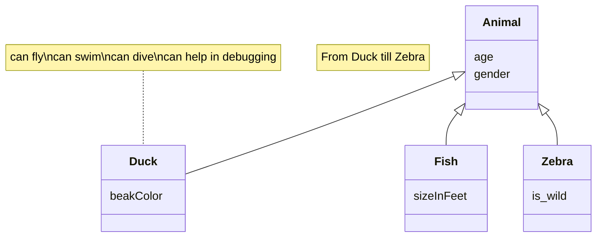

# Documento de diseño del sistema
**Asignatura:** Diseño y Pruebas (Grado en Ingeniería del Software, Universidad de Sevilla)  
**Curso académico:** 2025/2026 <!-- p.ej., 2025/2026 -->  
**Grupo/Equipo:** LI-04 <!-- p.ej., L4-03 Equipo 33 -->  
**Nombre del proyecto:** EndOfLine <!-- p. ej. Petris -->  
**Repositorio:** https://github.com/gii-is-DP1/dp1-2025-2026-li-4/ <!-- URL del repo -->  
**Integrantes (máx. 6):** Fernando José Fernández Fernández (HNR0360  / ferferfer@alum.us.es), Angelo Sho Moraschi (FLX0814  / angmor@alum.us.es), Alejandro Urbina Tamayo (VMC1155 / aleurbtam@alum.us.es), Makar Lavrov (RRP9465 / maklav@alum.us.es), Domingo Ruiz Bellido (DYS4321 / domruibel@alum.us.es).

_Esta es una plantilla que sirve como guía para realizar este entregable. Por favor, mantén las mismas secciones y los contenidos que se indican para poder hacer su revisión más ágil._ 

## Introducción

The project focuses on the implementation of the board game End of Line which is a strategic card-based board game where the main objective is simple: cut your opponent’s line before they cut yours. Players build paths by placing Line Cards on a shared grid, managing both placement and limited Energy Points to alter the flow of the game.

The game supports 2 players. The playing area is a 7x7 grid.

A typical match unfolds in rounds, each consisting of drawing cards and placing them to extend your line, always respecting directional connections. From the third round onward, players may spend energy to gain advantages such as speeding up, slowing down, or redirecting their line.

Games usually last between 15 and 40 minutes, depending on their choices. The match ends immediately when a player cannot continue their line on their turn — that player loses, and the opponent is declared the winner.

[Link to the video explaining the rules and playing a game](https://github.com/gii-is-DP1/dp1-2025-2026-li-4/blob/main/docs/Video.mp4)

## Diagrama(s) UML:

### Diagrama de Dominio/Diseño

_En esta sección debe proporcionar un diagrama UML de clases que describa el modelo de dominio, recuerda que debe estar basado en el diagrama conceptual del documento de análisis de requisitos del sistema pero que debe:_
•	_Especificar la direccionalidad de las relaciones (a no ser que sean bidireccionales)_
•	_Especificar la cardinalidad de las relaciones_
•	_Especificar el tipo de los atributos_
•	_Especificar las restricciones simples aplicadas a cada atributo de cada clase de domino_
•	_Incluir las clases específicas de la tecnología usada, como por ejemplo BaseEntity, NamedEntity, etc._
•	_Incluir los validadores específicos creados para las distintas clases de dominio (indicando en su caso una relación de uso con el estereotipo <<validates>>._

_Un ejemplo de diagrama para los ejercicios planteados en los boletines de laboratorio sería (hemos omitido las generalizaciones hacia BaseEntity para simplificar el diagrama):_


_Ej:_


_En este caso hemos vuelto a usar mermaid para crear el diagrama de dominio/diseño, pero recuerda que puedes usar cualquier otra herramienta que consideres oportuno para crear tus diagramas e inclurlos en este document como imagen tal y como se explica en [este tutorial](https://www.baeldung.com/ops/github-readme-insert-image)_

### Diagrama de Capas (incluyendo Controladores, Servicios y Repositorios)
_En esta sección debe proporcionar un diagrama UML de clases que describa el conjunto de controladores, servicios, y repositorios implementados, incluya la división en capas del sistema como paquetes horizontales tal y como se muestra en el siguiente ejemplo:_


*Nota importante para el alumno*: A la hora de entregar el proyecto, debes modificar la url para que esté asociada al respositorio concreto de tu proyecto. Date cuenta de que ahora mismo apunta al repositorio _gii-is-DP1/group-project-seed_.


_El diagrama debe especificar además las relaciones de uso entre controladores y servicios, entre servicios y servicios, y entre servicios y repositorios._
_Tal y como se muestra en el diagrama de ejemplo, para el caso de los repositorios se deben especificar las consultas personalizadas creadas (usando la signatura de su método asociado)._

_En este caso, como mermaid no soporta la definición de paquetes, hemos usado una [herramienta muy similar llamada plantUML}(https://www.plantuml.com/). Esta otra herramienta tiene un formulario para visualizar los diagramas previamente disponible en [https://www.plantuml.com/plantuml/uml/}(https://www.plantuml.com/plantuml/uml/). Lo que hemos hecho es preparar el diagrama en ese formulario, y una vez teníamos el diagrama lista, grabarlo en un fichero aparte dentro del propio repositorio, y enlazarlo con el formulario para que éste nos genera la imagen del diagrama usando una funcionalizad que nos permite especificar el código del diagrama a partir de una url. Por ejemplo, si accedes a esta url verás el editor con el código cargado a partir del fichero del repositorio original: [http://www.plantuml.com/plantuml/proxy?cache=no&src=https://raw.githubusercontent.com/gii-is-DP1/group-project-seed/main/docs/diagrams/LayersUMLPackageDiagram.iuml](http://www.plantuml.com/plantuml/proxy?cache=no&src=https://raw.githubusercontent.com/gii-is-DP1/group-project-seed/main/docs/diagrams/LayersUMLPackageDiagram.iuml)._

## Descomposición del mockups del tablero de juego en componentes

En esta sección procesaremos el mockup del tablero de juego (o los mockups si el tablero cambia en las distintas fases del juego). Etiquetaremos las zonas de cada una de las pantallas para identificar componentes a implementar. Para cada mockup se especificará el árbol de jerarquía de componentes, así como, para cada componente el estado que necesita mantener, las llamadas a la API que debe realizar y los parámetros de configuración global que consideramos que necesita usar cada componente concreto.

### Decomposition 1


- App - Main component of the application
    - $\color{#FFDFD3}{\textsf{NavBar - Lateral navigation bar}}$
        - $\color{yellow}{\textsf{NavButton - Shows a navigation button associated with an icon}}$
    - $\color{red}{\textsf{FriendsList - List of friends}}$
    - $\color{blue}{\textsf{ColorList - List of available card colors}}$

### Decomposition 2


- App - Main component of the application
    - $\color{#FFDFD3}{\textsf{NavBar - Lateral navigation bar}}$
        - $\color{yellow}{\textsf{NavButton - Shows a navigation button associated with an icon}}$
    - $\color{red}{\textsf{EnergyList - List of energy skills}}$
    - $\color{blue}{\textsf{EnergyDisplay - Remaining energy points display}}$
    - $\color{brown}{\textsf{CardDisplay - In-hand and on-board cards display}}$
    - $\color{magenta}{\textsf{ChatDisplay - Chat display}}$
        - $\color{lime}{\textsf{MessageDisplay - Chat message display}}$

### Decomposition 3


- App - Main component of the application
    - $\color{red}{\textsf{ResultDisplay - Pop-up displaying win status}}$

### Decomposition 1

- NavButton
    - Should hold information to the session of the player to display its username

- FriendsList
    - Should hold information of the player's friendships to display them
    - Once clicked, they will call the predefined API endpoint for sending a friend invite request

- ColorList
    - Should hold information of the list of available colors
    - Once clicked, they will call the predefined API endpoint for selecting a color

### Decomposition 2

- NavButton
    - Once clicked, they will call the predefined API endpoint for surrendering in a game, if its the correspoding button

- EnergyList
    - Should hold information of the list of skills that are available
    - Once clicked, they will call the predefined API endpoint for activating a skill

- EnergyDisplay
    - Should hold information of the amount of energy points that are still available
    - They will call the predefined API endpoint for reading the remaining skill points of a player

- CardDisplay
    - Should hold information of what card it is, and if its an in-hand card, or an on-deck card
    - Once clicked, they will call the predefined API endpoint for placing a card on the board, if its an in-hand card

- ChatDisplay
    - They will call the predefined API endpoint for reading the chat messages

- MessageDisplay
    - Should hold information of the content of the message and its sender

### Decomposition 3

- ResultDisplay
    - Should hold information of the winner of the game
    - They will call the predefined API endpoint for reading the winner

## Patrones de diseño y arquitectónicos aplicados
En esta sección de especificar el conjunto de patrones de diseño y arquitectónicos aplicados durante el proyecto. Para especificar la aplicación de cada patrón puede usar la siguiente plantilla:

### Patrón: < Nombre del patrón >
*Tipo*: Arquitectónico | de Diseño

*Contexto de Aplicación*

Describir las partes de la aplicación donde se ha aplicado el patrón. Si se considera oportuno especificar el paquete donde se han incluido los elementos asociados a la aplicación del patrón.

*Clases o paquetes creados*

Indicar las clases o paquetes creados como resultado de la aplicación del patrón.

*Ventajas alcanzadas al aplicar el patrón*

Describir porqué era interesante aplicar el patrón.

## Decisiones de diseño
_En esta sección describiremos las decisiones de diseño que se han tomado a lo largo del desarrollo de la aplicación que vayan más allá de la mera aplicación de patrones de diseño o arquitectónicos._

### Decisión X
#### Descripción del problema:*

Describir el problema de diseño que se detectó, o el porqué era necesario plantearse las posibilidades de diseño disponibles para implementar la funcionalidad asociada a esta decisión de diseño.

#### Alternativas de solución evaluadas:
Especificar las distintas alternativas que se evaluaron antes de seleccionar el diseño concreto implementado finalmente en el sistema. Si se considera oportuno se pude incluir las ventajas e inconvenientes de cada alternativa

#### Justificación de la solución adoptada

Describir porqué se escogió la solución adoptada. Si se considera oportuno puede hacerse en función de qué  ventajas/inconvenientes de cada una de las soluciones consideramos más importantes.
Os recordamos que la decisión sobre cómo implementar las distintas reglas de negocio, cómo informar de los errores en el frontend, y qué datos devolver u obtener a través de las APIs y cómo personalizar su representación en caso de que sea necesario son decisiones de diseño relevantes.

_Ejemplos de uso de la plantilla con otras decisiones de diseño:_

### Decisión 1: Importación de datos reales para demostración
#### Descripción del problema:

Como grupo nos gustaría poder hacer pruebas con un conjunto de datos reales suficientes, porque resulta más motivador. El problema es al incluir todos esos datos como parte del script de inicialización de la base de datos, el arranque del sistema para desarrollo y pruebas resulta muy tedioso.

#### Alternativas de solución evaluadas:

*Alternativa 1.a*: Incluir los datos en el propio script de inicialización de la BD (data.sql).

*Ventajas:*
•	Simple, no requiere nada más que escribir el SQL que genere los datos.
*Inconvenientes:*
•	Ralentiza todo el trabajo con el sistema para el desarrollo. 
•	Tenemos que buscar nosotros los datos reales

*Alternativa 1.b*: Crear un script con los datos adicionales a incluir (extra-data.sql) y un controlador que se encargue de leerlo y lanzar las consultas a petición cuando queramos tener más datos para mostrar.
*Ventajas:*
•	Podemos reutilizar parte de los datos que ya tenemos especificados en (data.sql).
•	No afecta al trabajo diario de desarrollo y pruebas de la aplicación
*Inconvenientes:*
•	Puede suponer saltarnos hasta cierto punto la división en capas si no creamos un servicio de carga de datos. 
•	Tenemos que buscar nosotros los datos reales adicionales

*Alternativa 1.c*: Crear un controlador que llame a un servicio de importación de datos, que a su vez invoca a un cliente REST de la API de datos oficiales de XXXX para traerse los datos, procesarlos y poder grabarlos desde el servicio de importación.

*Ventajas:*
•	No necesitamos inventarnos ni buscar nosotros lo datos.
•	Cumple 100% con la división en capas de la aplicación.
•	No afecta al trabajo diario de desarrollo y pruebas de la aplicación
*Inconvenientes:*
•	Supone mucho más trabajo. 
•	Añade cierta complejidad al proyecto

*Justificación de la solución adoptada*
Como consideramos que la división en capas es fundamental y no queremos renunciar a un trabajo ágil durante el desarrollo de la aplicación, seleccionamos la alternativa de diseño 1.c.

## Refactorizaciones aplicadas

Si ha hecho refactorizaciones en su código, puede documentarlas usando el siguiente formato:

### Refactorización X: 
En esta refactorización añadimos un mapa de parámtros a la partida para ayudar a personalizar la información precalculada de la que partimos en cada fase del juego.
#### Estado inicial del código
```Java 
class Animal
{
}
``` 
_Puedes añadir información sobre el lenguaje concreto en el que está escrito el código para habilitar el coloreado de sintaxis tal y como se especifica en [este tutorial](https://docs.github.com/es/get-started/writing-on-github/working-with-advanced-formatting/creating-and-highlighting-code-blocks)_

#### Estado del código refactorizado

```
código fuente en java, jsx o javascript
```
#### Problema que nos hizo realizar la refactorización
_Ej: Era difícil añadir información para implementar la lógica de negocio en cada una de las fases del juego (en nuestro caso varía bastante)_
#### Ventajas que presenta la nueva versión del código respecto de la versión original
_Ej: Ahora podemos añadir arbitrariamente los datos que nos hagan falta al contexto de la partida para que sea más sencillo llevar a cabo los turnos y jugadas_
