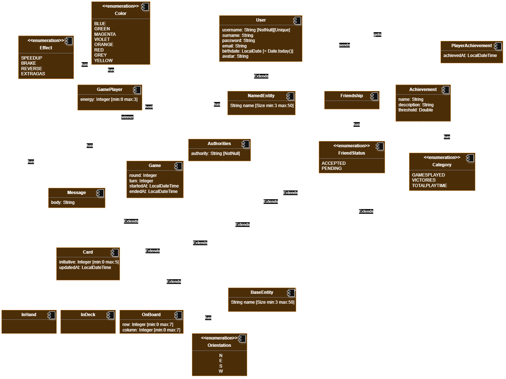
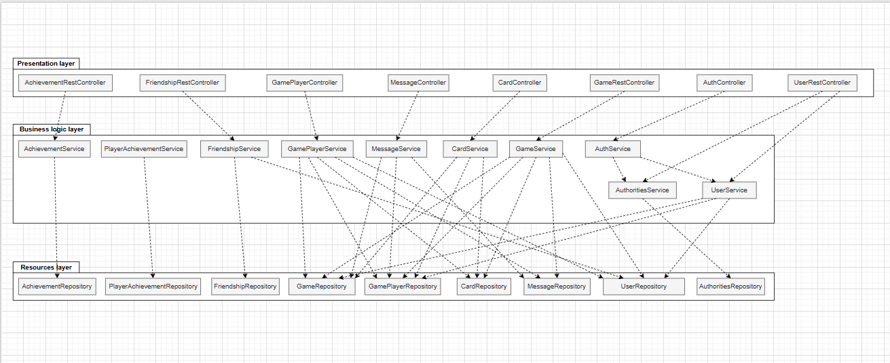

# Documento de diseño del sistema
**Asignatura:** Diseño y Pruebas (Grado en Ingeniería del Software, Universidad de Sevilla)  
**Curso académico:** 2025/2026 <!-- p.ej., 2025/2026 -->  
**Grupo/Equipo:** LI-04 <!-- p.ej., L4-03 Equipo 33 -->  
**Nombre del proyecto:** EndOfLine <!-- p. ej. Petris -->  
**Repositorio:** https://github.com/gii-is-DP1/dp1-2025-2026-li-4/ <!-- URL del repo -->  
**Integrantes (máx. 6):** Fernando José Fernández Fernández (HNR0360  / ferferfer@alum.us.es), Angelo Sho Moraschi (FLX0814  / angmor@alum.us.es), Alejandro Urbina Tamayo (VMC1155 / aleurbtam@alum.us.es), Makar Lavrov (RRP9465 / maklav@alum.us.es), Domingo Ruiz Bellido (DYS4321 / domruibel@alum.us.es).

_Esta es una plantilla que sirve como guía para realizar este entregable. Por favor, mantén las mismas secciones y los contenidos que se indican para poder hacer su revisión más ágil._ 

## Introducción

The project focuses on the implementation of the board game End of Line which is a strategic card-based board game where the main objective is simple: cut your opponent’s line before they cut yours. Players build paths by placing Line Cards on a shared grid, managing both placement and limited Energy Points to alter the flow of the game.

The game supports 2 players. The playing area is a 7x7 grid.

A typical match unfolds in rounds, each consisting of drawing cards and placing them to extend your line, always respecting directional connections. From the third round onward, players may spend energy to gain advantages such as speeding up, slowing down, or redirecting their line.

Games usually last between 15 and 40 minutes, depending on their choices. The match ends immediately when a player cannot continue their line on their turn — that player loses, and the opponent is declared the winner.

[Link to the video explaining the rules and playing a game](https://github.com/gii-is-DP1/dp1-2025-2026-li-4/blob/main/docs/Video.mp4)

## Diagrama(s) UML:

### Diagrama de Dominio/Diseño

_En esta sección debe proporcionar un diagrama UML de clases que describa el modelo de dominio, recuerda que debe estar basado en el diagrama conceptual del documento de análisis de requisitos del sistema pero que debe:_
•	_Especificar la direccionalidad de las relaciones (a no ser que sean bidireccionales)_
•	_Especificar la cardinalidad de las relaciones_
•	_Especificar el tipo de los atributos_
•	_Especificar las restricciones simples aplicadas a cada atributo de cada clase de domino_
•	_Incluir las clases específicas de la tecnología usada, como por ejemplo BaseEntity, NamedEntity, etc._
•	_Incluir los validadores específicos creados para las distintas clases de dominio (indicando en su caso una relación de uso con el estereotipo <<validates>>._

_Un ejemplo de diagrama para los ejercicios planteados en los boletines de laboratorio sería (hemos omitido las generalizaciones hacia BaseEntity para simplificar el diagrama):_

### Layers diagram

## Descomposición del mockups del tablero de juego en componentes

En esta sección procesaremos el mockup del tablero de juego (o los mockups si el tablero cambia en las distintas fases del juego). Etiquetaremos las zonas de cada una de las pantallas para identificar componentes a implementar. Para cada mockup se especificará el árbol de jerarquía de componentes, así como, para cada componente el estado que necesita mantener, las llamadas a la API que debe realizar y los parámetros de configuración global que consideramos que necesita usar cada componente concreto.

### Decomposition 1

- App - Main component of the application
    - $\color{#FFDFD3}{\textsf{NavBar - Lateral navigation bar}}$
        - $\color{yellow}{\textsf{NavButton - Shows a navigation button associated with an icon}}$
    - $\color{red}{\textsf{FriendsList - List of friends}}$
    - $\color{blue}{\textsf{ColorList - List of available card colors}}$

### Decomposition 2

- App - Main component of the application
    - $\color{#FFDFD3}{\textsf{NavBar - Lateral navigation bar}}$
        - $\color{yellow}{\textsf{NavButton - Shows a navigation button associated with an icon}}$
    - $\color{red}{\textsf{EnergyList - List of energy skills}}$
    - $\color{blue}{\textsf{EnergyDisplay - Remaining energy points display}}$
    - $\color{brown}{\textsf{CardDisplay - In-hand and on-board cards display}}$
    - $\color{magenta}{\textsf{ChatDisplay - Chat display}}$
        - $\color{lime}{\textsf{MessageDisplay - Chat message display}}$

### Decomposition 3

- App - Main component of the application
    - $\color{red}{\textsf{ResultDisplay - Pop-up displaying win status}}$

### Decomposition 1

- NavButton
    - Should hold information to the session of the player to display its username

- FriendsList
    - Should hold information of the player's friendships to display them
    - Once clicked, they will call the predefined API endpoint for sending a friend invite request

- ColorList
    - Should hold information of the list of available colors
    - Once clicked, they will call the predefined API endpoint for selecting a color

### Decomposition 2

- NavButton
    - Once clicked, they will call the predefined API endpoint for surrendering in a game, if its the correspoding button

- EnergyList
    - Should hold information of the list of skills that are available
    - Once clicked, they will call the predefined API endpoint for activating a skill

- EnergyDisplay
    - Should hold information of the amount of energy points that are still available
    - They will call the predefined API endpoint for reading the remaining skill points of a player

- CardDisplay
    - Should hold information of what card it is, and if its an in-hand card, or an on-deck card
    - Once clicked, they will call the predefined API endpoint for placing a card on the board, if its an in-hand card

- ChatDisplay
    - They will call the predefined API endpoint for reading the chat messages

- MessageDisplay
    - Should hold information of the content of the message and its sender

### Decomposition 3

- ResultDisplay
    - Should hold information of the winner of the game
    - They will call the predefined API endpoint for reading the winner

## Design and architectural patterns designed
In this section, specify the set of design and architectural patterns applied during the project. To specify the application of each pattern, you can use the following template:

### Pattern: Single Page Application
*Tipo*: Design

*Application context*

The SPA pattern was applied in the frontend, specifically using the React library to manage component-based views and state, concerning all source files in the src/frontend directory.

*Classes or packages created*

To implement the pattern, the code residing in the src/frontend directory was created, including key components such as the Router component (e.g., using React Router).

*Advantages achieved by applying the pattern*

The pattern constitutes an advantage when building web applications, as it allows for more fluid response times, an overall better user experience and a cleaner separation of concerns between frontend (presentation/logic) and backend (API/data).

### Pattern: Model View Controller (MVC)
*Tipo*: Architectural

*Application context*

The MVC pattern was applied as a layered architecture across the project. In the Backend, it structures the API logic and data access. In the Frontend (SPA), it structures the presentation layer, separating the UI (View) from the application's state management (Model).

*Classes or packages created*

The project is structured in two main areas:

- Backend (src/main/java/...): Includes the Controllers (e.g., UserRestController.java) and the Model/Logic layer via Service and Repository classes (e.g., UserService.java, UserRepository.java), which manage the in-memory data.

- Frontend (frontend/src): Implements the View component through UI components.

*Advantages achieved by applying the pattern*

The MVC pattern allows us to easily separate the implemented functionality, achieving high cohesion and low coupling:

- Business logic (residing in the Services and Model).

- Presentation (residing in the View).

- User interface event handling (residing in the Controller).

### Pattern: Container/Presentational components
*Tipo*: Design

*Application context*

This design pattern was implemented across the entire frontend application (SPA) to clearly separate logic and data fetching from UI rendering. The MyProfile component serves as a prime example of this pattern.

*Classes or packages created*

The structure clearly separates the concerns:

- Container Component (Logic): The MyProfile.js file itself acts as the Container (Smart Component). It handles:

  - State management (useState, useFetchState).

  - Business logic (input validations, handleSaveChanges).

  - Data fetching (useEffect).

  - API communication (fetch calls).

  - It uses external Service (tokenService) and Utility (getErrorModal, deleteMyself) functions to keep its own logic clean.

- Presentational Components (UI/View): The component delegates the pure rendering responsibilities to reusable UI components, such  as the imported Modal, Container, Input, and Button components from reactstrap.

*Advantages achieved by applying the pattern*

The pattern enforces Separation of Concerns by dividing component roles, resulting in:

- Improved Reusability: Presentational components can be reused anywhere, as they are decoupled from the application's specific state.

- Easier Maintenance: Logic changes (Container) are separated from UI changes (Presentational), simplifying debugging and updates.

- Clarity: It clearly defines what the application does (Container) versus how it looks (Presentational).

### Pattern: Dependency Injection
*Tipo*: Design

*Application context*

The Dependency Injection (DI) pattern is fundamental to the Backend (Java/Spring Boot) architecture, specifically ensuring loose coupling between the application's layers (Controllers, Services, and Repositories). It is applied universally to manage the dependencies between the application's components, known as Beans.

*Classes or packages created*

The pattern's application is evident in how components are structured to receive dependencies, rather than create them:

- The UserRestController.java file is a concrete example, where the UserService and AuthoritiesService dependencies are requested via the constructor.

- The framework automatically provides instances of components like the Services (Service.java) and Repositories (Repository.java) wherever they are needed.

*Advantages achieved by applying the pattern*

The application of DI results in significant architectural benefits for the backend:

- Loose Coupling: Components only declare what dependencies they need, without knowing how those dependencies are instantiated.

- Easier Maintenance and Testing: It allows for easy substitution of mock components during unit testing.

### Pattern: Proxy pattern
*Tipo*: Design

*Application context*

The Proxy pattern is used implicitly by the Spring Framework in the Backend (Java/Spring Boot) architecture. This pattern is essential for adding transactional behavior, security checks, and other cross-cutting concerns to the Service layer without modifying the original code.

*Classes or packages created*

No code was manually created. The Spring framework automatically generates a Proxy object that wraps the Service components (like UserService) when features like database transactions (@Transactional) need to be applied.

*Advantages achieved by applying the pattern*

The pattern allows the framework to create a placeholder that adds functionality transparently:

- Transparent Functionality: Adds features (e.g., managing a database transaction) before and after a method runs, keeping your core business logic clean.

- Separation of Concerns: Separates the infrastructure logic (Proxy) from the business logic (Service).

### Pattern: Front Controller
*Tipo*: Design

*Application context*

The pattern is used in the Backend (Spring Boot) to ensure all incoming web requests are handled by a single, central component.

*Classes or packages created*

No classes were manually created. The pattern is implemented automatically by the Spring component, the DispatcherServlet.

*Advantages achieved by applying the pattern*

- Centralization: All requests pass through one point, making it easy to apply cross-cutting logic like security or logging globally.

- Simple Routing: Decouples request receiving from request processing.

### Pattern: Domain Model
*Tipo*: Design

*Application context*

The pattern is used in the Backend to define the core business logic and data structures.

*Classes or packages created*

The Entity classes (such as User.java and PlayerAchievement.java) and all domain packages (e.g., game/, friendship/) are the direct implementation of this pattern.

*Advantages achieved by applying the pattern*

- Single Source of Truth: Entities define the application's rules and relationships.

- Separation from Persistence: It keeps business logic separate from the data access layer (Repository Pattern).

### Pattern: Service Layer
*Tipo*: Design

*Application context*

The Service Layer pattern is used in the Backend to encapsulate the core business logic and isolate it from Controllers and Repositories.

*Classes or packages created*

The pattern is implemented by the Service classes (e.g., UserService.java, AuthoritiesService.java), which reside in the service layer of your domain packages.

*Advantages achieved by applying the pattern*

- Decoupling: Separates complex business rules from the user interface and API handling.

- Transaction Management: It is the centralized location for applying transaction boundaries, ensuring data consistency.

- Reusability: Business logic can be reused across different parts of the application.

### Pattern: Data Mapper
*Tipo*: Architectural

*Application context*

The pattern is used in the Backend to separate the Domain Model (Entities) from the database.

*Classes or packages created*

It is implemented through the Repository interfaces (e.g., UserRepository.java), which act as gateways to the database.

*Advantages achieved by applying the pattern*

- Domain Purity: Keeps business logic clean of data access code.

- Independence: Allows the database technology to be changed without affecting the application core.

### Pattern: Repository
*Tipo*: Design

*Application context*

The pattern is used in the Backend to handle all data access. It lets the application work with data as if it were a simple collection of objects.

*Classes or packages created*

It is implemented by the Repository interfaces (e.g., UserRepository.java). These interfaces contain all the methods needed to save, find, or delete data.

*Advantages achieved by applying the pattern*

- Simple Data Access: Business logic doesn't need to know how the data is stored.

- Decoupling: Clearly separates the business logic (Service Layer) from the data storage specifics.

### Pattern: Hooks
*Tipo*: Design

*Application context*

This pattern is used in the Frontend to manage state and logic within functional components (instead of classes).

*Classes or packages created*

It is implemented through core React functions like useState, useEffect, and useNavigate. It is also used to create Custom Hooks (e.g., useFetchState) for reusing logic.

*Advantages achieved by applying the pattern*

- Organization: Allows grouping related logic (e.g., data fetching) into a single reusable function.

- Simplicity: Makes components shorter and easier to read and maintain.

## Decisiones de diseño
_En esta sección describiremos las decisiones de diseño que se han tomado a lo largo del desarrollo de la aplicación que vayan más allá de la mera aplicación de patrones de diseño o arquitectónicos._

### Decision 1: Use JsonIgnore to transfer data
#### Problem description:

Some entities in our project contain many properties, some of which are not necessary. Furthermore, they have a bidirectional association with the other entities, which would create loops upon serialization.

#### Evaluated solution:

Use `@JsonIgnore` to ignore some associations when serializing.

*Advantages:*
- Simple, as it only requires us to annotate a property.

*Drawbacks:*
- Fields need to be manually excluded with the annotation.

#### Justification of the adopted solution:
We decided on the `@JsonIgnore` as the solution for this problem, as it is a simple annotation to exclude the property from being transferred.

### Decision 2: Use custom pop-ups for errors
#### Problem description:

We need a clear way to show the error message to the user when an error occurs (form validation, server side error, ...).

#### Evaluated solution alternatives:

*Alternative 2.a*: Use native web alerts.

*Advantages*:

- Supported by default by browsers

*Drawbacks*:

- Visually ugly

*Alternative 2.b*: Use custom pop-ups.

*Advantages*:

- Visually appealing

*Drawbacks*:

- Might have to modify in order to work with different browser view types or sizes

#### Justification of the adopted solution

We decided to use custom pop-ups for showing error messages to the user as they are visually more appealing and in general the risk of the pop-up breaking is minimal.

### Decision 3: Use of generalization for card types

There are three types of `Card`s in this project, `InHand`, `InDeck`, and `OnBoard`, which represent the cards in each area of the game. We need a clear way of differentiating them.

#### Evaluated solution:

Use of generalization.

*Advantages*:

- You can treat all subclasses (`InHand`, `OnBoard`) as the same base `Card` type, allowing you to manage them together in a single list or function.

*Drawbacks*:

- The subclasses become highly dependent on the parent class. A change in the `Card` class could potentially break the functionality of the subclasses.

#### Justification of the adopted solution

We chose generalization because `InHand`, `InDeck`, and `OnBoard` all represent specific types of a `Card`. This "is-a" relationship is the perfect use case for generalization. By creating a general `Card` superclass, these subclasses can inherit all the common properties.

## Refactorizaciones aplicadas

We have not performed any refactorizations yet as the project is still in an early development phase. As we advance in the development we will record any need of refactorizations that arise.
